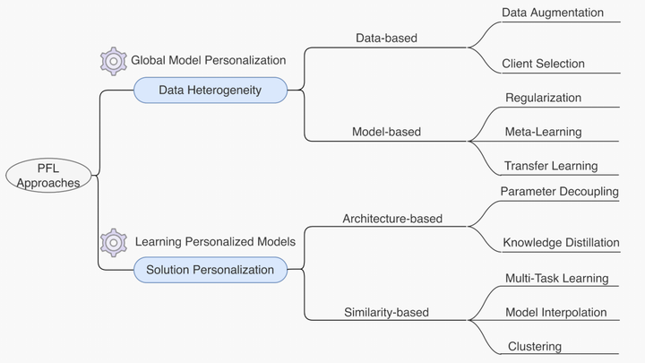
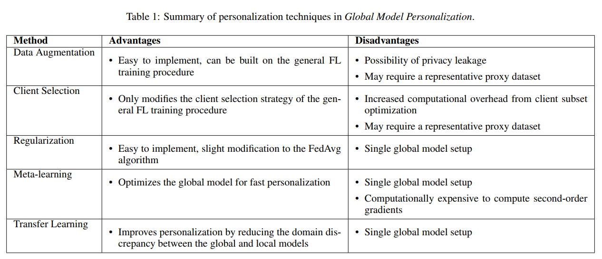

# Cited from Towards Personalized Federated Learning

## Why need Federated Learning?

No need to elaborate too much

## Personalized Federated Learning

Traditional Federated Learning faced several basic challenges:

- High heterogeneity  caused bad convergence
- Lack of personalized solutions

Four categories and ten subcategories of personalized federated learning solutions

