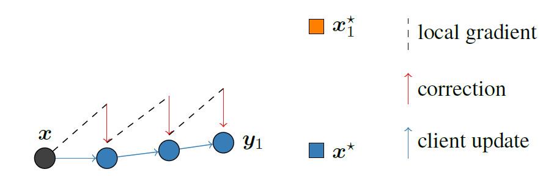

# Stochastic Controlled Averaging for Federated Learning
## source
The paper is from [Stochastic Controlled Averaging for Federated Learning]([SCAFFOLD: Stochastic Controlled Averaging for Federated Learning (mlr.press)](http://proceedings.mlr.press/v119/karimireddy20a.html))

Now it is a new framework to solve problem Non-IID. But before learn SCAFFORD how to handle it, we need to know about the different conditions of Non-IID.


## Convergence of FedAvg

picture shows that when every single client go through several local steps, the local updates move to the $x_i^*$


server updates move towards $\frac{1}{N}\sum_i{x_i^*}$ instead of to the true optimum $x*$

## SCAFFOLD algorithm

Steps for the SCAFFOLD updates.

> SCAFFOLD has three main steps: local updates to the client model (3), local updates to the client
> control variate (4), and aggregating the updates (5). We
> describe each in more detail

| parameters    | server | clients |
| ------------- | ------ | ------- |
| state variate | $c$    | $c_i$   |
|               |        |         |
|               |        |         |

$$
c = \frac{1}{N}\sum{c_i}
$$
All above be initialized to 0. 

Graph below illustrates the principle of SCAFFOLD, when the gradient start to converge in drift direction, we use the a correction term($c-c_i$) to ensures the update moves towards the true optimum $x^*$


over its local data performing K updates of the form:
$$y_i \leftarrow y_i - \eta(g_i(y_i) + c - c_i) $$
but after respective iteration, $c_i$ also updated.

$$
c_i^+ \leftarrow 
 \begin{cases}
 Option I. \quad g_i(x),\,\,or\\
 Option II. \quad c_i - c + \frac{1}{K\eta_l}(x - y_i)\\
 \end{cases}
$$

global model update
$$x \leftarrow x + \frac{\eta_g}{\vert{S}\vert}\sum_{i \in S}(y_i - x)$$
$$c \leftarrow c + \frac{1}{N}\sum_{i \in S}(c_i^+ - c_i)$$

$g_i(x)$ is the gradient of the i-th client model relative to the current global model
是第i个客户端模型相对当前全局模型的梯度

## Pseudo code
```python
def server():
    for round in rounds:
        model_gap,c_gap = clients_update(sample_clients,global_model,global_c,global_steps_size)
        global_model_gap,global_c_gap
        sample_nums = 0
        for i in range(len(sample_clients)):
            sample_mums += sample_clients[i].num
            global_model_gap += model_gap[i]
            global_c_gap += c_gap[i]
        global_model_gap /= sample_nums
        global_c_gap /= sample_nums
        global_model = global_model + global_steps_size * global_model_gap
        global_c += (sample_nums * global_c_gap)/nums
    
def clients_update(sample_clients,global_model,global_c,global_steps_size):
    init model_gap,c_gap
    for client in sample_clients:
        parallel_update(K,g,c,model_gap,c_gap)
    return model_gap,c_gap


def parallel_update():
    local_model = global_model
    for k in range(K):
        g[i] = batch_gradient(local_model)
        local_model = local_model - local_steps_size * (g[i] - c[i] + c)
    c_new = c[i] - c + 1/K*local_steps_size(global_model - local_model)
    #c_new = g[i](global_model)
    c_gap[i],c[i] = c_new - c[i],c_new
    model_gap[i] = local_model - global_model
    # c[i] = c[i] - c + 1/K*local_steps_size(global_model - local_model)
```

## Q&A

为什么该算法的实验结果和fedprox差别这么大？
