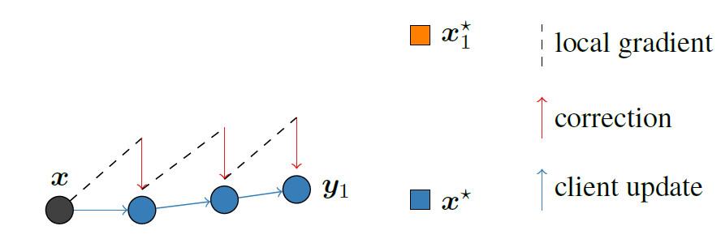

# Stochastic Controlled Averaging for Federated Learning
## source
The paper is from [Stochastic Controlled Averaging for Federated Learning]([SCAFFOLD: Stochastic Controlled Averaging for Federated Learning (mlr.press)](http://proceedings.mlr.press/v119/karimireddy20a.html))

Now it is a new framework to solve problem Non-IID. But before learn SCAFFORD how to handle it, we need to know about the different conditions of Non-IID.

## Convergence of FedAvg

picture shows that when every single client go through several local steps, the local updates move to the $x_i^*$

server updates move towards $\frac{1}{N}\sum_i{x_i^*}$ instead of to the true optimum $x*$

graph below illustrates the principle of SCAFFOLD, when the gradient start to converge in drift direction, we use the a correction term($c-c_i$) to ensures the update moves towards the true optimum $x^*$

为什么该算法的实验结果和fedprox差别这么大？
